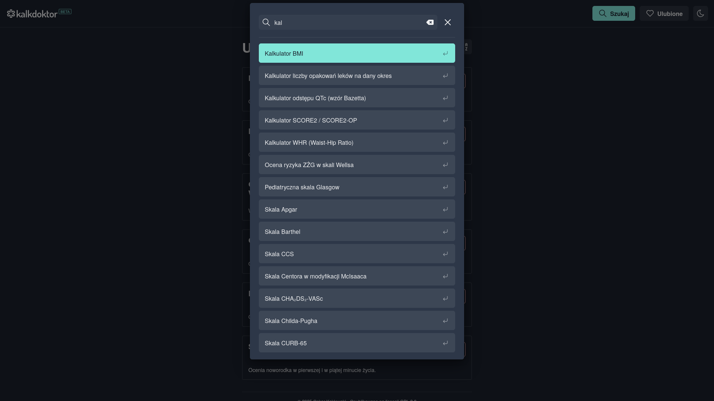
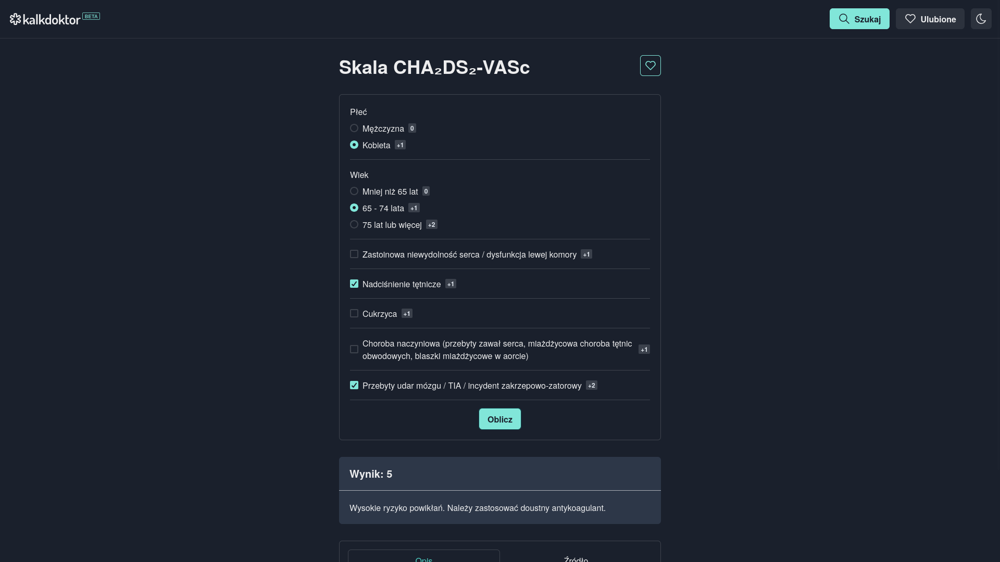

# Kalkdoktor

## About

Kalkdoktor is a web app written in React and TypeScript with use of [Chakra UI](https://github.com/chakra-ui/chakra-ui). It contains medical calculators and scales that help doctors diagnose a patient and choose the right treatment.

Available only in Polish 🇵🇱 language. Please just treat is as lorem ipsum. 😉

## Live Version

https://kalkdoktor.pl/

Deployed with [Netlify](https://www.netlify.com/).

## Features

- **Medical scales and calculators**: Contains a set of medical tools enabling the diagnosis of the patient.
- **Favorites**: Add selected calculators to your favorites and share them between devices.
- **Search**: Search for your favorite calculators.
- **Dark Mode**: Switch between light, dark and automatic modes.
- **Modern UI**: Clean, professional design with consistent color schemes, fonts and style.
- **Responsive Design**: Use it on any device you want.
- **Progressive Web App**: Install the PWA and use it offline.

## Screenshots

## Run Locally

1. Clone the project to your local machine:

`git clone https://github.com/kaklewski/kalkdoktor`

2. Navigate to the project directory:

`cd kalkdoktor`

3. Install the dependencies:

`npm install`

4. Start the development server:

`npm run dev`

## Build with Vite

1. Build the dist:

`npm run build`

2. Preview the build:

`npm run preview`
